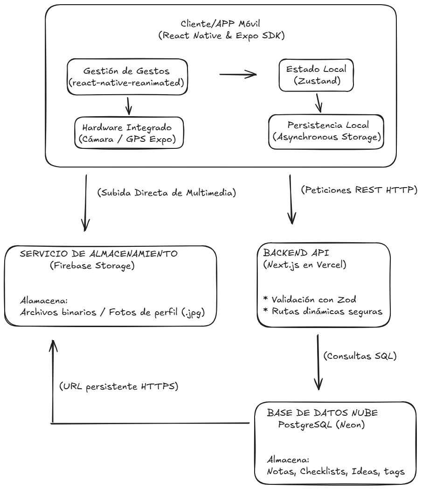

# 📝 NoteFlow
> Gestión inteligente de notas, tareas e ideas

Aplicación móvil nativa de alto rendimiento diseñada para ofrecer una experiencia fluida con persistencia de datos local y una interfaz optimizada para dispositivos iOS y Android.

---

## 🏗️ Arquitectura y ADRs
El diseño del sistema ha sido documentado siguiendo registros de arquitectura (ADRs) para garantizar la escalabilidad y mantenibilidad del código:

* [ADR 001: Gestión de estado con Zustand](./docs/adr/001-use-zustand.md)
* [ADR 002: Workflow gestionado de Expo](./docs/adr/002-expo-managed-workflow.md)
* [ADR 003: Estrategia de almacenamiento híbrido](./docs/adr/003-hybrid-storage-strategy.md)



---

## 🚀 Características Principales

- **Búsqueda en Tiempo Real:** Barra de búsqueda integrada en todas las pantallas.
- **Edición Dinámica:** Guardado automático (Debounce) y gestión de Checklists interactiva.
- **Checkboxes Visibles:** Interfaz mejorada para listas de tareas con indicadores visuales de estado.
- **Persistencia Local:** Sincronización híbrida entre base de datos relacional y almacenamiento local.
- **Rendimiento Optimizado:** Uso de **FlashList** y renderizado atómico con Zustand.
- **Feedback Táctil:** Integración de **Expo Haptics** para una experiencia nativa.

## 🛠️ Tecnologías

| Mobile & UI | Uso |
|----------|-----|
| React Native / Expo 51 | Framework y SDK para desarrollo nativo |
| React Native Paper | Componentes UI basados en Material Design |
| Lucide React Native | Iconografía vectorial escalable |

| Estado y Lógica | Uso |
|---------|-----|
| Zustand | Gestión de estado global ligera y rápida |
| Expo Router | Navegación basada en archivos |
| Zod | Validación de esquemas y tipos de datos |

## 💻 Instalación y Desarrollo
```bash
# 1. Clonar el repositorio
git clone [https://github.com/juliaht15/NoteFlow.git](https://github.com/juliaht15/NoteFlow.git)
cd noteflow

# 2. Instalar dependencias
npm install

# 3. Iniciar el servidor de Expo
npx expo start
Nota: Escanea el código QR desde la app Expo Go para previsualizar.

🛰️ Despliegue y Actualizaciones (EAS)
Este proyecto utiliza EAS Update para el despliegue de actualizaciones críticas sin pasar por la Store.

Actualización OTA: eas update --auto

Builds nativos: eas build --platform [android|ios]

Desarrollado durante las prácticas en Corner Estudios — Julia Huertas — 2026